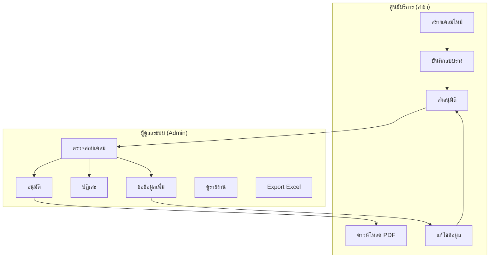
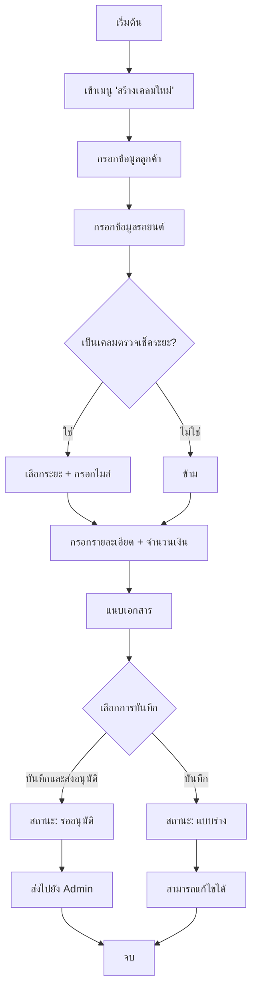
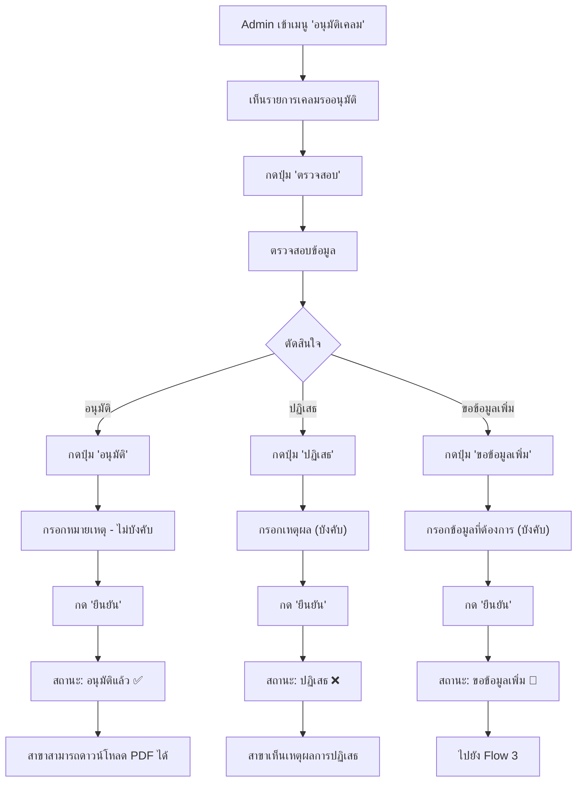
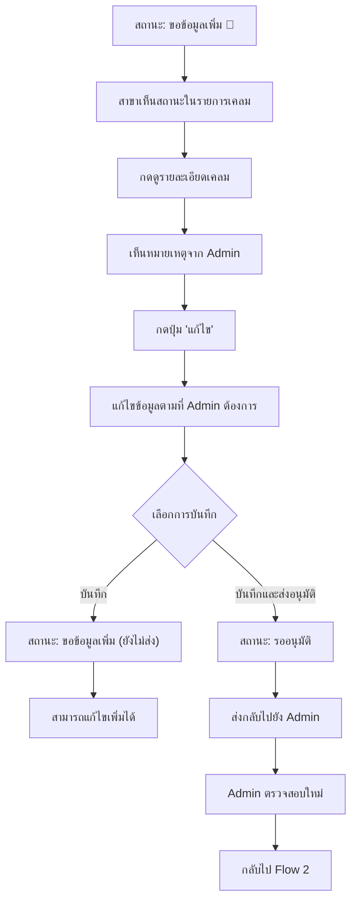
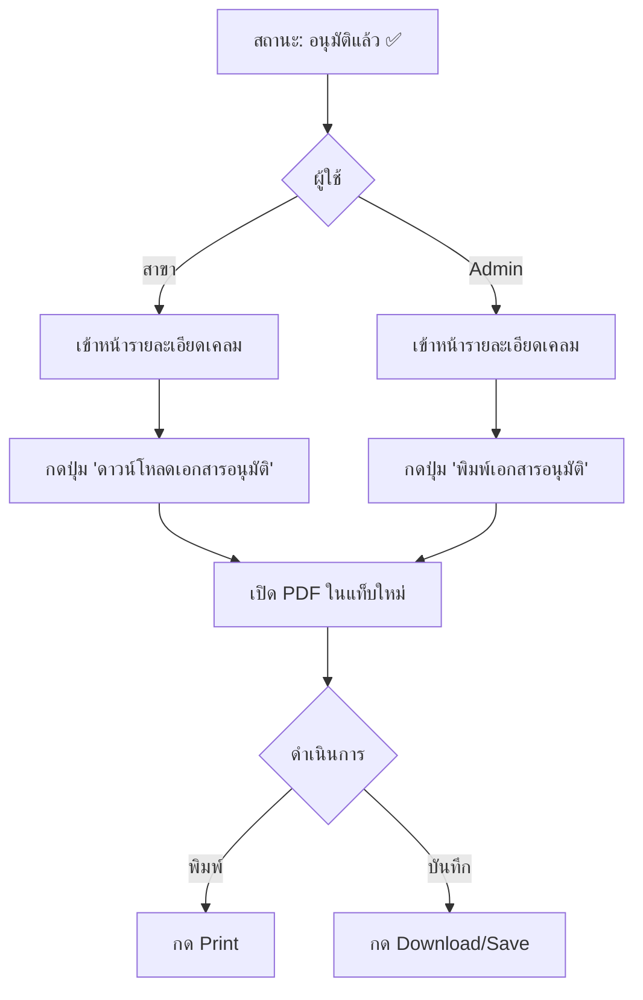
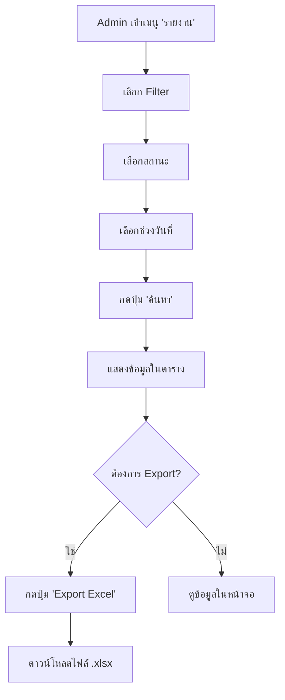
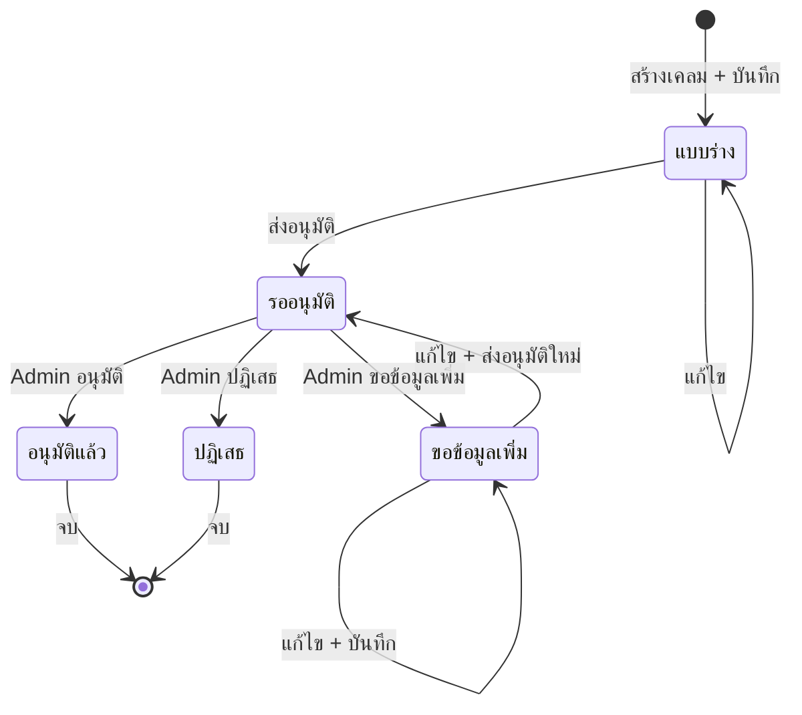
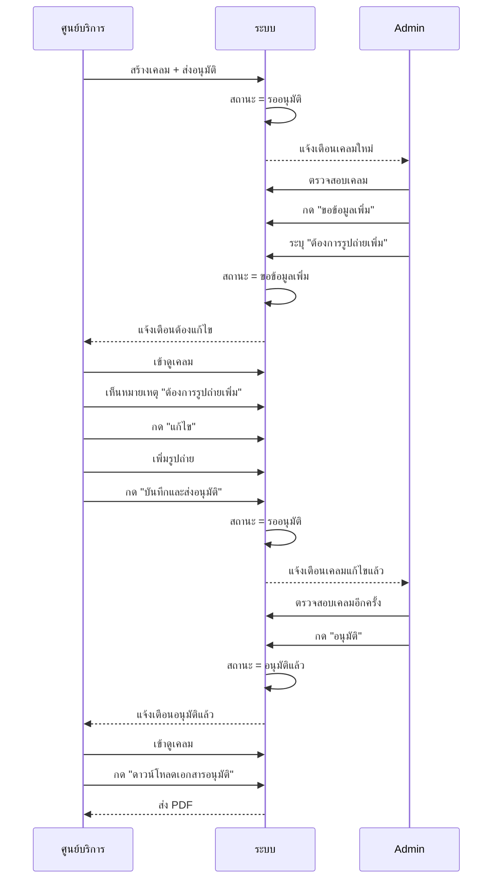

# System Flow - ระบบเคลมบริการหลังการขาย EV Services

## ภาพรวมระบบ (System Overview)

---

## Flow 1: การสร้างและส่งเคลม (สาขา)

---

## Flow 2: การตรวจสอบและอนุมัติเคลม (Admin)

---

## Flow 3: การแก้ไขและส่งเคลมใหม่ (กรณีขอข้อมูลเพิ่ม)

---

## Flow 4: การดาวน์โหลดเอกสารอนุมัติ (PDF)

---

## Flow 5: การดูรายงานและ Export Excel (Admin)

---

## State Diagram: สถานะเคลม

---

## ตารางสรุป Actions ของแต่ละ Role

### ศูนย์บริการ (สาขา)

| Action | สถานะเดิม | สถานะใหม่ | คำอธิบาย |
|--------|-----------|-----------|----------|
| สร้างเคลม + บันทึก | - | แบบร่าง | สร้างเคลมใหม่ บันทึกเป็นแบบร่าง |
| สร้างเคลม + ส่งอนุมัติ | - | รออนุมัติ | สร้างและส่งอนุมัติทันที |
| แก้ไข + บันทึก | แบบร่าง | แบบร่าง | แก้ไขแบบร่าง |
| แก้ไข + ส่งอนุมัติ | แบบร่าง | รออนุมัติ | ส่งแบบร่างไปอนุมัติ |
| แก้ไข + บันทึก | ขอข้อมูลเพิ่ม | ขอข้อมูลเพิ่ม | แก้ไขแต่ยังไม่ส่ง |
| แก้ไข + ส่งอนุมัติ | ขอข้อมูลเพิ่ม | รออนุมัติ | ส่งกลับไป Admin ใหม่ |
| ดาวน์โหลด PDF | อนุมัติแล้ว | - | ดาวน์โหลดเอกสาร |

### ผู้ดูแลระบบ (Admin)

| Action | สถานะเดิม | สถานะใหม่ | คำอธิบาย |
|--------|-----------|-----------|----------|
| อนุมัติ | รออนุมัติ | อนุมัติแล้ว | อนุมัติเคลม |
| ปฏิเสธ | รออนุมัติ | ปฏิเสธ | ปฏิเสธเคลม (ต้องระบุเหตุผล) |
| ขอข้อมูลเพิ่ม | รออนุมัติ | ขอข้อมูลเพิ่ม | ส่งกลับให้สาขาแก้ไข |
| พิมพ์เอกสาร | อนุมัติแล้ว | - | เปิด PDF |
| Export Excel | - | - | ดาวน์โหลดรายงาน |

---

## Sequence Diagram: กรณี ขอข้อมูลเพิ่ม

---

*เอกสารนี้อัพเดทล่าสุด: มกราคม 2569*
